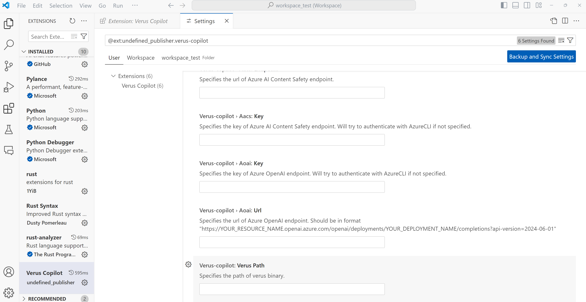
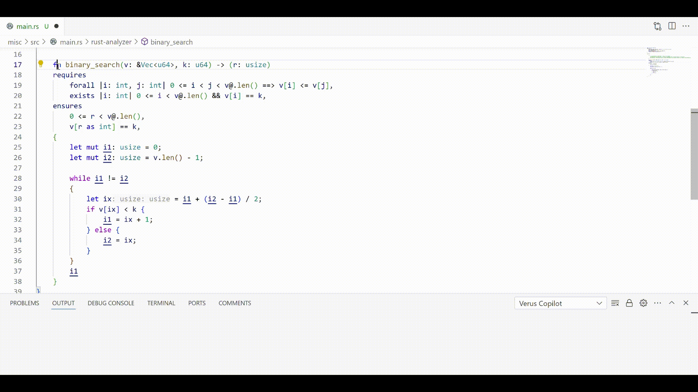

# Verus Copilot for Visual Studio Code

*Still under active development, features may not work as you expect*


## Get Started
To use Verus Copilot VSCode Plugin, you first need to install Rust, Verus, and Verus Analyzer.
- Install [rust](https://www.rust-lang.org/tools/install)
- Install [verus](https://github.com/verus-lang/verus)
- Install and configure [verus-analyzer](https://github.com/verus-lang/verus-analyzer/tree/main)
    - An easier way to install is to download `rust-analyzer-no-server.vsix` and `os specific verus-analyzer language server binary` from [verus-analyzer's release page](https://github.com/verus-lang/verus-analyzer/releases)
        - The compatable rust-analyzer vsix needed to be installed as a vscode-extension
        - The verus analyzer will be referenced as vscode's setting in following steps.
    - [Config `verus-analyzer`](https://github.com/verus-lang/verus-analyzer?tab=readme-ov-file#vs-code-setup) in your VSCode setting and your project's Cargo file
        - VSCode setting
        ```json
        {
            "rust-analyzer.server.path": "verus analyzer binary path",
            "rust-analyzer.checkOnSave.overrideCommand": [
                "verus binary path",
            ]
        }
        ```
        - Cargo.toml
        ```toml
        [package.metadata.verus.ide]
        extra_args = "..."
        ```
        - Check if verus-analyzer is correctly installed
            - Open a verus file
            - Press `ctrl+s` and a message box with verus verification results will be prompted
            - Open VS Code's command palette (press `ctrl+ship+p`), and try to execute command `rust-analyzer (debug command): Show Syntax Tree`. A editor with syntax tree of current verus / rust file will be opened.
- Install `verus-copilot`
    - make sure that [node.js](https://nodejs.org/en) is available on your machine
    - compile the Verus-Copilot vscode extension
      ```
      $cd verus-copilot-vscode
      $npm install
      $npm install -g @vscode/vsce
      $vsce package
      ```
      After this step, you should see a verus-copilot-0.0.1.vsix file in your verus-copilot-vscode directory.
    - Go to the EXTENSIONS tab of your VSCode, choose `Install from VSIX...' from the drop-down menu, and choose the vsix file you just generated.
      The installation should finish in a few seconds.
- Config `verus-copilot`
    - Python dependencies
        - Verus Copilot will run its proof-synthesis python code with python extension's active intepreter.
            - You can choose the environment with `Python: Select Interpreter` command
        - Following python libs are requried.
            - `openai`
            - `numpy`
            - `tomli`
    - LLM endpoints
        - Verus Copilot needs to invoke LLM for its proof synthesis, and you will be asked to provide an LLM endpoint.
          (Currently only `Azure OpenAI` is supported, raw `OpenAI` endpoints may be supported in the future.)
    - Important VS Code settings
          In our plugin's configuration window depicted below, there are three key configuration items
        - Verus-copilot › Aoai: Url (Required)
        - Verus-copilot › Aoai: Key (Optional)
            - extension will try to authenticate through AzureCli if not specified
        - Verus-copilot: Verus Path (Optional)
            - extension will try to use `rust-analyzer.checkOnSave.overrideCommand` if not specified
  
        
  

- Use Verus Copilot

    All features will be exposed via code actions (lightbulb button) in VSCode editor, following command are supported now:
    - generate verus proof within selected function
    - repair incorrect or particially correct loop invariants
    - generate proof in response to a verification error of "unsatisfied function post-condition"
    - generate proof in response to an Verus assert that cannot be verified

    The proof synthesized by Verus Copilot will be shown in the Refactor Preview panel for users to review.
  
    It is possible that Verus Copilot makes no proof suggestion, either because the underlying Verus/Rust program is already verified or because it fails to synthesize proof deemed useful by itself.

    The proof synthesis process of Verus Copilot is non-deterministic. Therefore, you may get different proof suggestion when you invoke Verus Copilot several times.

    If you are interested in automated Verus proof synthesis, you can also check our command-line [research tool](https://github.com/microsoft/verus-proof-synthesis).

## Examples

- The test/workspace_test folder provides a small example Rust/Verus workspace for you to try Verus Copilot upon
- Here are some examples of using Verus Copilot
      
      


## All configurations

- `verus-copilot.verusPath`: Specifies the path of verus binary. Will try to use `rust-analyzer.checkOnSave.overrideCommand` if not specified
- `verus-copilot.aoai.url`: Specifies the url of aoai endpoint. Should be in format "https://YOUR_RESOURCE_NAME.openai.azure.com/openai/deployments/YOUR_DEPLOYMENT_NAME/completions?api-version=2024-06-01"
- `verus-copilot.aoai.key`: Specifies the key of aoai endpoint. Will try to authenticate with AzureCLI if not specified

## Responsible AI FAQ

- **What is Verus Copilot?**
    - Verus Copilot is a VS Code extension that can automatically generate some of the Verus proof annotations with user's code and help developers prove the correctness of Rust programs.
- **What can Verus Copilot do?**
    - Verus Copilot provide code action suggestions (lightbulb icon) to vscode editor while user writing verus / rust code. 
    - When code action triggered, the extension will interact with user-provided OpenAI endpoints and verus binary to automatically generate or refine verus proof annotations.
- **What is Verus Copilot's intended use?**
    - It aims to automatically generate correctness proof for any programs written in Rust which will improve the correctness and security of the code.
- **How was Verus Copilot evaluated? What metrics are used to measure performance?**
    - Verus Copilot is evaluated by human on the quality of proof annotations and whether it saves time for developers. An internal manual created benchmark is also used to provide a reference result of the pipeline.
    - The evaluation metrics include the correctness of the proof annotations, the time delay in providing code suggestions, and the time saved by developers.
- **What are the limitations of Verus Copilot? How can users minimize the impact of Verus Copilot's limitations when using the system?**
    - **Code suggested by Verus Copilot may not always be correct.** Users should be careful and choose if the changes should be applied. If the extension detect a potential wrong or low quality result, it will alert user by prompting a warning message.
    - Verus Copilot is limited by the quality of provided OpenAI model. Users are encouraged to supply endpoint with high-quality OpenAI model.
    - Verus Copilot is also limited by the complexity of the code. Currently it only supports single Rust file without file-level dependencies. Users can minimize the impact of these limitations by providing simple and self-contained code.
    - Given the research nature of this work, production or commercial uses are considered out of scope until more testing and validation can be done.
- **What operational factors and settings allow for effective and responsible use of Verus Copilot?**
    - Users need to provide their own OpenAI endpoints and verus binary via vscode settings
        - The performance and accuracy of suggestions may be influcened by the model behind the provided endpoint.
    - Temperature of OpenAI model
        - The temperature affects the computation of token probabilities when generating output through the large language model.
        - Higher temperature can result in more creative results but also increase the risk of "hallucination" which often leads to wrong results.
    - Maximum number retries of Verus Copilot
        - The setting determines how many times the extension will communicate with the OpenAI endpoints to refine the results. More retries can lead to more responses, potentially improving the quality of final result.

- **Are there risks of potential prompt attack?**
    - We feel the risk is very low, as Verus Copilot only suggests changes to Verus ghost code not to your Rust executable code. Furthermore, all changes are first suggested in Refactor Preview panel for your review.
    - If you are concerned, you have the option of using [Azure AI Content Safety](https://azure.microsoft.com/en-us/products/ai-services/ai-content-safety) to prevent potetial risks of [prompt attacks](https://learn.microsoft.com/en-us/azure/ai-services/content-safety/concepts/jailbreak-detection) by filling in your own Azure AI Content Safety endpoint in Verus Copilot Plugin setting.

## Contributing

This project welcomes contributions and suggestions.  Most contributions require you to agree to a
Contributor License Agreement (CLA) declaring that you have the right to, and actually do, grant us
the rights to use your contribution. For details, visit https://cla.opensource.microsoft.com.

When you submit a pull request, a CLA bot will automatically determine whether you need to provide
a CLA and decorate the PR appropriately (e.g., status check, comment). Simply follow the instructions
provided by the bot. You will only need to do this once across all repos using our CLA.

This project has adopted the [Microsoft Open Source Code of Conduct](https://opensource.microsoft.com/codeofconduct/).
For more information see the [Code of Conduct FAQ](https://opensource.microsoft.com/codeofconduct/faq/) or
contact [opencode@microsoft.com](mailto:opencode@microsoft.com) with any additional questions or comments.

## Trademarks

This project may contain trademarks or logos for projects, products, or services. Authorized use of Microsoft 
trademarks or logos is subject to and must follow 
[Microsoft's Trademark & Brand Guidelines](https://www.microsoft.com/en-us/legal/intellectualproperty/trademarks/usage/general).
Use of Microsoft trademarks or logos in modified versions of this project must not cause confusion or imply Microsoft sponsorship.
Any use of third-party trademarks or logos are subject to those third-party's policies.
